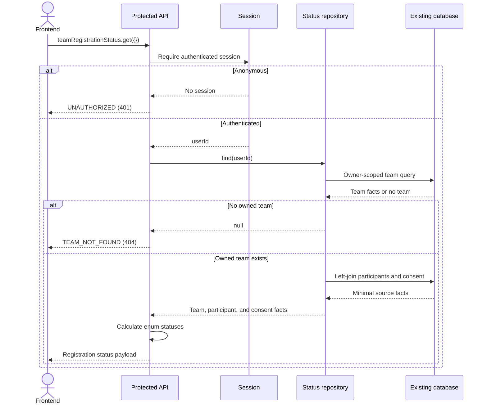
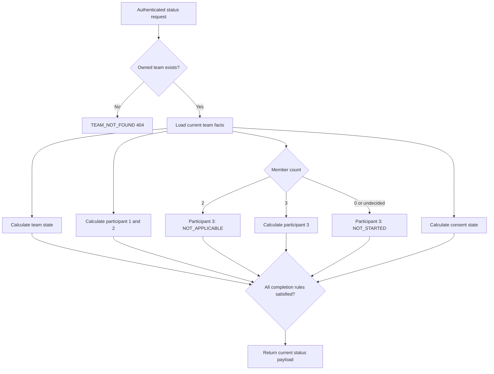

# ADR 001: Current-user team registration status

---

status: accepted
date: 2026-08-03
branch: feat/current-user-team-registration-status
---

This decision defines how the API represents current team-registration progress. The
status is computed from the authenticated user's existing team, participant rows, and
consent row; it is not stored as a separate snapshot.

## Decision

For a Team Owner, teamRegistrationStatus.get accepts an empty object:

```ts
{
}
```

The authenticated session is the only source of user identity. The Team Owner frontend
does not send userId or teamId.

The API resolves the team owned by the current user. If no team exists, the endpoint
returns the existing structured error:

```
code: TEAM_NOT_FOUND
status: 404
```

This lets frontend code distinguish first-time onboarding from an ordinary successful
status response.

Registration Operators inspect a selected Team through the separate
teamRegistrationStatus.getByTeamId procedure:

```ts
{
  teamId: string;
}
```

This explicit selector is unavailable to Team Owners.

When a team exists, the response always contains non-null teamId and memberCount:

```ts
{
  teamId: string;
  memberCount: number;
  team: TeamRegistrationItemStatus;
  participant1: TeamRegistrationItemStatus;
  participant2: TeamRegistrationItemStatus;
  participant3: TeamRegistrationItemStatus;
  termsAndConditions: TeamRegistrationItemStatus;
  isComplete: boolean;
}
```

## Domain context and language

This section is the embedded context/glossary for this decision. It is intentionally
kept with the ADR so readers can understand the domain without locating a separate
context file.

### Registration domain

**User**:
Authenticated account that owns one team registration.

**Team**:
User-owned registration container. A team may remain draft-friendly while its
registration details are being completed.

**Registration item**:
One independently displayed progress item: team details, participant slot 1, slot 2,
slot 3, or terms and conditions.

**Participant slot**:
An indexed participant position from 1 to 3. Slot 3 is conditional on declared team
size.

**Consent**:
The team's six acceptance flags covering platform terms, competition rules, guardian,
health-data, privacy, and publicity/media consent.

### Status language

**NOT_STARTED**:
Team exists, but an item has no registration progress. This includes a missing
participant row, a missing consent row, all consent flags being false, or an undecided
draft member count for slot 3. It does not represent “no team”; no-team requests
return TEAM_NOT_FOUND.

**IN_PROGRESS**:
Some registration data exists, but required data or documents remain incomplete.

**COMPLETED**:
All requirements for the item are satisfied.

**NOT_APPLICABLE**:
An item does not apply to this team. Currently used only for participant slot 3 when
memberCount is 2.

**NOT_CREATED**:
Not part of the status vocabulary. Missing participant or consent records are already
represented by NOT_STARTED; adding another label would not provide new domain
information.

## Status rules

| Item                 | NOT_STARTED                                                                   | IN_PROGRESS                                                   | COMPLETED                                               | NOT_APPLICABLE |
| -------------------- | ----------------------------------------------------------------------------- | ------------------------------------------------------------- | ------------------------------------------------------- | -------------- |
| Team                 | Never returned for a successful request                                       | Team exists but name, school, image, or valid size is missing | Name, school, image, and member count 2 or 3 are valid  | Never          |
| Participant 1/2      | Participant row does not exist                                                | Row exists but one or more required documents are missing     | Identity, academic record, and portrait documents exist | Never          |
| Participant 3        | Team size is undecided, or participant row does not exist for a 3-person team | Row exists but a required document is missing                 | All required documents exist for a 3-person team        | Team size is 2 |
| Terms and conditions | No consent row or all six flags are false                                     | Some consent flags are true                                   | All six consent flags are true                          | Never          |

Required participant documents:

- Identity document
- Academic record document
- Portrait photo

Required consent flags:

- codernTermsAccepted
- competitionRulesAccepted
- guardianConsentObtained
- healthDataConsent
- privacyPolicyAccepted
- publicityMediaConsent

isComplete is true only when:

- team is COMPLETED
- participant1 is COMPLETED
- participant2 is COMPLETED
- participant3 is COMPLETED or NOT_APPLICABLE
- termsAndConditions is COMPLETED

## Request flow



## State calculation



## Data and ownership

The repository reads existing tables only:

- teams: owner, team identity fields, image, and declared member count
- team_participants: participant indexes and required document references
- team_consents: six consent flags

The query is scoped by authenticated userId before status calculation. Missing
participant and consent rows remain observable as null source facts through left
joins. The repository returns only the fields required by the status calculator.

No registration-status table, status history, audit snapshot, migration, or write flow
is introduced.

## Considered alternatives

### Accept teamId from the Team Owner frontend

Rejected. The application currently permits one Team per Team Owner, so a
client-provided Team ID adds input and ownership branches without providing product
value. Server-side session ownership is the clearer boundary. Registration Operators
use the separate explicit-Team procedure because they work across Teams.

### Return an initial all-NOT_STARTED payload when no team exists

Rejected. A successful status payload implies an existing team and therefore had to
use nullable context fields. TEAM_NOT_FOUND gives frontend code an explicit first-time
onboarding branch and keeps successful output non-null.

### Add NOT_CREATED

Rejected. Existing source facts already map missing participant and consent records to
NOT_STARTED. There is no additional product behavior that requires a separate
record-lifecycle label.

### Store a status snapshot

Rejected. Registration status is current computed truth, and existing team,
participant, and consent data remain the source of truth.

## Consequences

Positive:

- Frontend sends a stable empty input.
- User identity and team ownership stay server-side.
- First-time users are recognizable through TEAM_NOT_FOUND.
- Successful payloads have non-null team context.
- Existing CRUD and database schema remain unchanged.

Trade-offs:

- Frontend must handle TEAM_NOT_FOUND as an expected onboarding response.
- The Team Owner endpoint does not support explicit Team IDs.
- Status does not provide historical withdrawal or audit information.

## Related implementation

- packages/api/src/features/team-registration-status/team-registration-status.schema.ts
- packages/api/src/features/team-registration-status/team-registration-status.repository.ts
- packages/api/src/features/team-registration-status/team-registration-status.service.ts
- packages/api/src/features/team-registration-status/team-registration-status.router.ts
- packages/api/src/features/team-registration-status/**test**/team-registration-status.router.test.ts
